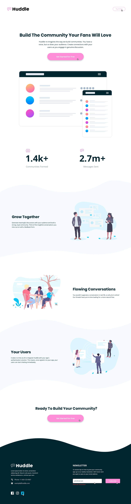

# Frontend Mentor - Profile card component solution

This is a solution to the [Profile card component challenge on Frontend Mentor](https://www.frontendmentor.io/challenges/profile-card-component-cfArpWshJ). Frontend Mentor challenges help you improve your coding skills by building realistic projects. 

## Table of contents

- [The challenge](#the-challenge)
- [Screenshot](#screenshot)
- [Links](#links)
- [My process](#my-process)
- [Built with](#built-with)
- [What I learned](#what-i-learned)
- [Continued development](#continued-development)
- [Author](#author)


**Note: Delete this note and update the table of contents based on what sections you keep.**

## Overview

### The challenge

- Build out the project to the designs provided

### Screenshot

  

### Links


<a href="https://heisemmaco-dev.github.io/huddle-landing-page-with-curved-sections-master-heisemmaco-dev/">Live Site</a>

### Built with

- Semantic HTML5 markup
- CSS custom properties
- Flexbox

### What I learned

in this project i learned how to design extensively with css

```html
<h1>Some HTML code I'm proud of</h1>
<header>this were, i placed the page heading</header>
<main> the wrap tag </main>
<section> another on </section>

<source srcset>
```
```css
.proud-of-this-css {
  display: flex;
  padding: 5%;
  gap: 20px;
  padding: 10px;
  justify-content: center;
  align-items: center;
}
```

### Continued development

wow! i enjoy using the flex and grid, those properties are cool to use i think i'm good with css for now 

## Author

- Frontend Mentor - [@Moderateemmaco](https://www.frontendmentor.io/profile/Moderateemmaco)
- Twitter - [@heisemmaco](https://www.twitter.com/heisemmaco)
